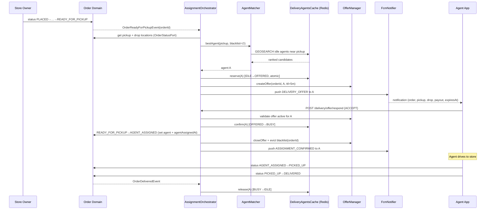
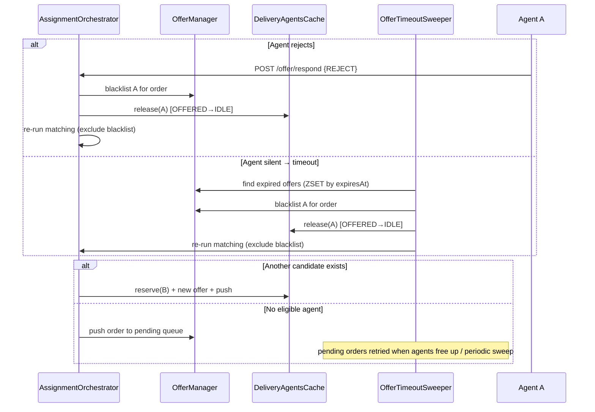

# Delivery Management - High-Level Design (HLD)

## 1. Problem statement

Every order flows through statuses from `PLACED` to `DELIVERED` (or `REJECTED`). The store owner
owns the order up to **`READY_FOR_PICKUP`**. From that point the **Delivery Management System (DMS)**
takes over:

1. **Assign** the order to the best available delivery agent - one who is `IDLE` (not busy) and
   **nearby the pickup store**.
2. **Drive** the order through the rest of its lifecycle, all the way to `DELIVERED`.

The DMS must behave like a realtime logistics system: agents are mobile, availability changes by the
second, agents can decline work, and the system must keep trying until the order is delivered.

## 2. Goals & non-goals

**Goals**

- Optimal, automatic assignment the moment an order becomes `READY_FOR_PICKUP`.
- Offer-based assignment with agent consent (accept / reject / timeout), exactly like Zomato/Swiggy.
- Resilience: agent declines, app crashes, no agents online - the order still progresses.
- A clean module boundary so the DMS can later become its own service.
- Admin visibility and manual override.

**Non-goals (for this iteration)**

- Batching/pooling multiple orders onto one agent trip.
- Multi-leg routing, surge pricing, or incentive engines.
- Finer-grained tracking statuses (`ARRIVED_AT_STORE`, `OUT_FOR_DELIVERY`, …). We add exactly one
  status: `AGENT_ASSIGNED`.
- WebSocket-based realtime streaming. We use FCM push + REST polling.

## 3. Actors

| Actor | Role | Interacts via |
|-------|------|---------------|
| **Store owner** | Prepares the order, marks it `READY_FOR_PICKUP`. | Existing `/order/status/update` |
| **Delivery agent** | Goes on/off duty, reports location, accepts/rejects offers, picks up & delivers. | DMS REST APIs + FCM |
| **Customer** | Watches order progress + agent location. | Order tracking API (polling) |
| **Admin** | Monitors the agent pool, sees recommendations, manually assigns when needed. | DMS admin APIs |
| **The system (DMS)** | Matches, offers, times out, re-offers, escalates. | Internal orchestration |

## 4. Component overview

The DMS is split into focused components under `com.reptile.pharmacy.delivery`. Each has a single
responsibility and a narrow interface.

```
                          ┌─────────────────────────────────────────────────────┐
                          │                    pharma-service                     │
                          │                                                       │
  Store owner ──READY──▶  │  Order domain                                         │
                          │   └─ publishes OrderReadyForPickupEvent ──┐           │
                          │                                           ▼           │
                          │                          ┌────────────────────────┐   │
                          │                          │  AssignmentOrchestrator │   │  ← brain of the DMS
                          │                          └───────────┬────────────┘   │
                          │            ┌─────────────────────────┼───────────────┐│
                          │            ▼                         ▼               ▼ │
                          │     ┌────────────┐          ┌──────────────┐  ┌──────────────┐
                          │     │ AgentMatcher│          │ OfferManager │  │  FcmNotifier │
                          │     │ (optimal    │          │ (offer +     │  │  (push to    │
                          │     │  selection) │          │  blacklist + │  │   agent)     │
                          │     └─────┬──────┘          │  timeout)    │  └──────────────┘
                          │           │                 └──────┬───────┘                  │
                          │           ▼                        ▼                          │
                          │     ┌─────────────────────────────────────┐                  │
                          │     │        DeliveryAgentsCache           │  ◀── Redis (GEO) │
                          │     │  (live agent pool, GEO search,       │                  │
                          │     │   atomic reserve/release)            │                  │
                          │     └─────────────────────────────────────┘                  │
                          │           ▲                        ▲                          │
                          │           │                        │ status updates           │
                          │   agent location (REST)     OrderStatusPort (outbound)        │
                          │           │                        ▼                          │
                          │     ┌────────────┐          ┌──────────────┐                  │
                          │     │DeliveryCtrl│          │ Order domain │                  │
                          │     └────────────┘          └──────────────┘                  │
                          └─────────────────────────────────────────────────────┘
                                      ▲                                   │
                              REST    │                                   │ FCM push
                                      │                                   ▼
                              ┌──────────────┐                   ┌──────────────┐
                              │ Delivery app │  ◀────────────────│  Agent device │
                              └──────────────┘                   └──────────────┘
```

### Component responsibilities

| Component | Responsibility | Key collaborators |
|-----------|----------------|-------------------|
| **`DeliveryController`** | REST surface for agents/admin/customer. Already exists for location; extended here. | `DeliveryService` |
| **`AssignmentOrchestrator`** | The brain. Reacts to "order ready", drives the offer loop, reacts to agent responses & timeouts, escalates. | everything below |
| **`AgentMatcher`** | Pure matching logic: given a pickup location + an exclusion (blacklist) set, return the best candidate(s). | `DeliveryAgentsCache`, `DistanceFinder` |
| **`DeliveryAgentsCache`** | The live agent pool, backed by **Redis GEO**. Atomic reserve/release of agents. *(Interface already exists; in-memory impl to be replaced by Redis impl.)* | Redis |
| **`OfferManager`** | Owns offer records, the per-order blacklist, and offer expiry bookkeeping. | Redis |
| **`OfferTimeoutSweeper`** | Scheduled job that detects expired offers and the pending-order retry. | `OfferManager`, `AssignmentOrchestrator` |
| **`FcmNotifier`** | Sends push notifications to agents (and optionally customers). | Firebase Admin SDK |
| **`OrderStatusPort`** | Outbound port the DMS uses to read pickup/drop locations and to move the order status. Keeps the DMS decoupled from order internals. | Order domain |
| **`DistanceFinder`** | Distance between two points. Haversine today (`@Primary`), GraphHopper road-distance available. *(Already exists.)* | - |

## 5. End-to-end happy path



## 6. Reject / timeout / re-offer path



## 7. Data stores at a glance

| Store | Holds | Why |
|-------|-------|-----|
| **Postgres** (`orders`, `delivery_agents`) | Source of truth: order status, assigned agent, lifecycle timestamps, agent identity + FCM token. | Durable, transactional, survives restarts. |
| **Redis** (GEO + hashes + sets + zsets) | Live, fast-changing state: on-duty agent pool, last-known locations, active offers, per-order blacklist, pending queue. | Sub-millisecond geo queries + atomic reservation; ephemeral by nature. |

The split is deliberate: **anything that must survive forever lives in Postgres; anything that is
"right now" and high-churn lives in Redis.** Redis is treated as rebuildable cache + coordination,
never as the only copy of order truth. See [`data-model.md`](/docs/backend-gateway/delivery-data-model).

## 8. Why these technology choices

- **Redis GEO** gives us `GEOSEARCH … BYRADIUS … ASC` - exactly the "nearest idle agents to the
  store" query - in one O(log N) call, plus atomic state transitions via Lua. An in-memory
  `ConcurrentHashMap` (today's impl) can't survive a restart or scale horizontally; Redis can.
- **FCM-only** keeps the agent app simple and battery-friendly: a push wakes the app for an offer,
  and all responses/location go over plain REST. The 5-minute offer window plus a server-side
  timeout sweeper means we never depend on push being delivered - a missed push simply times out and
  re-offers, so correctness does not hinge on FCM reliability.
- **One new status (`AGENT_ASSIGNED`)** is the minimum needed to model "an agent has committed but
  hasn't picked up yet", which the offer flow requires. We resist adding more until product needs
  them.

## 9. How the order domain triggers the DMS

The hook point is the existing `READY_FOR_PICKUP` transition in
`OrderServiceImpl.updateStatus(...)`. Rather than calling DMS classes directly, the order domain
**publishes a domain event** (`OrderReadyForPickupEvent`) after the status is committed. The DMS
listens for it.

This keeps the dependency arrow pointing **one way** (DMS depends on order events, not vice-versa)
and makes the future extraction trivial - the in-process Spring event becomes a message on a queue.
Details and the exact transactional ordering (publish *after* commit) are in
[`modularization-and-migration.md`](/docs/backend-gateway/delivery-modularization).

## 10. Open design surface

The HLD intentionally defers the hard details to the LLD docs:

- Exact matching/scoring formula → [`matching-and-assignment.md`](/docs/backend-gateway/delivery-matching)
- Offer record shape, blacklist TTL, sweeper cadence → [`offer-lifecycle-and-scheduler.md`](/docs/backend-gateway/delivery-offer-lifecycle)
- Redis key naming + atomic Lua scripts → [`data-model.md`](/docs/backend-gateway/delivery-data-model)
- Every tunable and assumption → [`assumptions-and-decisions.md`](/docs/backend-gateway/delivery-assumptions)
