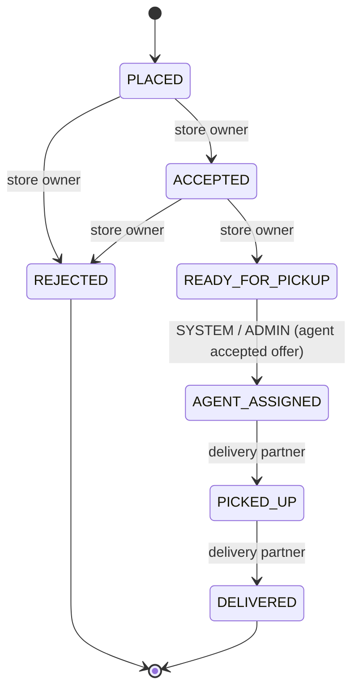
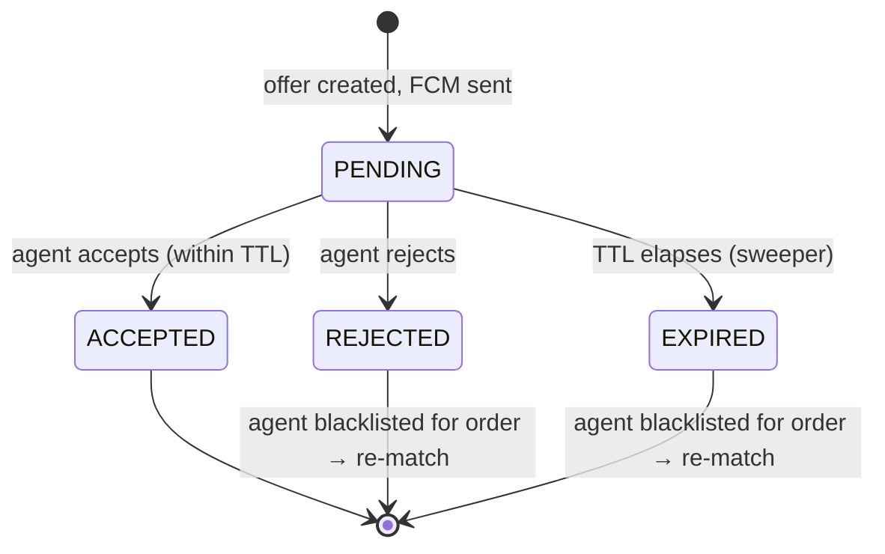
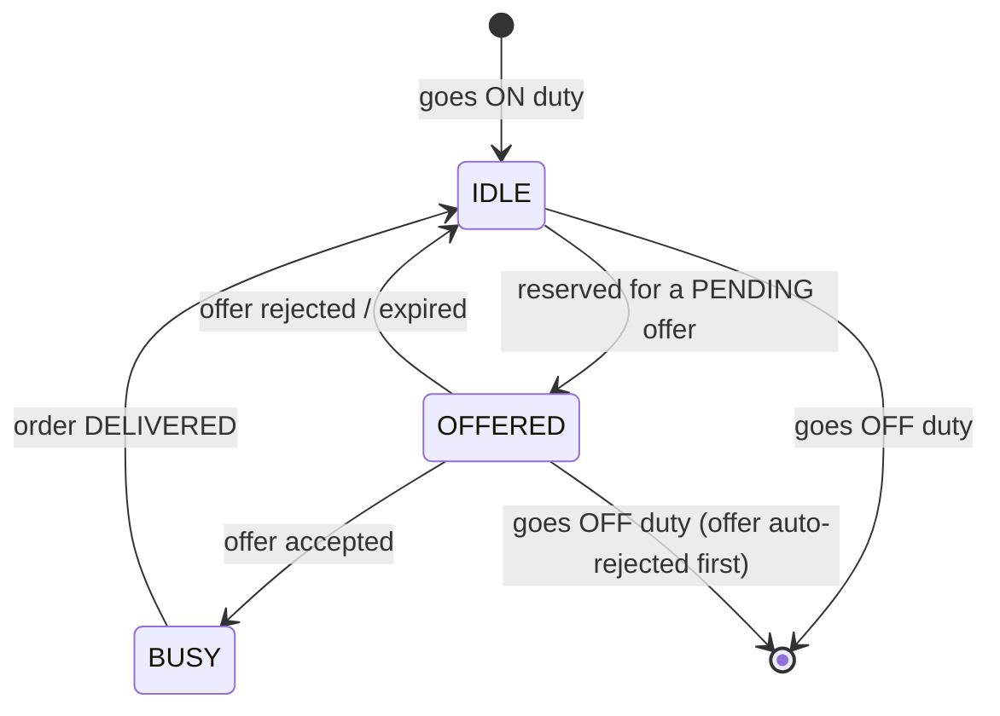

# Order Status & State Machines

The DMS coordinates **three** state machines that must stay consistent with each other:

1. **Order status** (persisted in Postgres - the source of truth).
2. **Offer state** (lives in Redis - one active offer per order).
3. **Agent availability** (lives in Redis - the live pool).

This document defines all three, who is allowed to drive each transition, and how they interlock.

---

## 1. Order status machine

### 1.1 The change: add `AGENT_ASSIGNED`

We add **exactly one** new status, `AGENT_ASSIGNED`, between `READY_FOR_PICKUP` and `PICKED_UP`.

**Before**

```
PLACED → ACCEPTED → READY_FOR_PICKUP → PICKED_UP → DELIVERED
   │         │
   └──► REJECTED ◄──┘
```

**After**

```
PLACED → ACCEPTED → READY_FOR_PICKUP → AGENT_ASSIGNED → PICKED_UP → DELIVERED
   │         │
   └──► REJECTED ◄──┘
```



### 1.2 Critical migration note: enum ordinal safety

`Order.orderStatus` is mapped with a bare `@Enumerated` (see `Order.java`), which defaults to
**`EnumType.ORDINAL`** - the enum's **position** is what's stored in the DB, not its name.

That means **you must not insert `AGENT_ASSIGNED` in the middle of the `OrderStatus` enum.** Doing so
would shift the ordinals of `PICKED_UP` (4→5) and `DELIVERED` (5→6) and silently corrupt every
existing row.

Two safe options:

| Option                                           | What to do                                                                                                                               | Trade-off                                                                               |
| ------------------------------------------------ | ---------------------------------------------------------------------------------------------------------------------------------------- | --------------------------------------------------------------------------------------- |
| **A - Append (recommended, low-risk)**           | Add `AGENT_ASSIGNED` as the **last** enum constant (ordinal 6). The _logical_ order is enforced by `OrderStatusMutator`, not by ordinal. | Enum declaration order no longer matches lifecycle order - a comment must explain this. |
| **B - Switch to `@Enumerated(EnumType.STRING)`** | Migrate the column to store names, backfill existing rows, then `AGENT_ASSIGNED` can go anywhere.                                        | Requires a data migration on the `orders` table; larger change.                         |

**Recommendation: Option A** for this iteration (no data migration), with a loud comment on the enum.
Revisit Option B when we next touch the order schema. This must be mirrored in both `OrderStatus`
(persistence) and `OrderStatusRequest` (API) enums, plus `OrderStatusMapper`.

### 1.3 Transition ownership & validation

Transitions are enforced in `OrderStatusMutator`. The new/changed rows:

| From               | To               | Allowed actor                 | Notes                                                                                                                      |
| ------------------ | ---------------- | ----------------------------- | -------------------------------------------------------------------------------------------------------------------------- |
| `READY_FOR_PICKUP` | `AGENT_ASSIGNED` | **SYSTEM** (DMS) or **ADMIN** | Triggered when an agent accepts the offer, or admin manually assigns. **Not** the store owner, **not** the agent directly. |
| `AGENT_ASSIGNED`   | `PICKED_UP`      | **DELIVERY_PARTNER**          | Only the assigned agent. _(Replaces the old `READY_FOR_PICKUP → PICKED_UP` agent rule.)_                                   |
| `PICKED_UP`        | `DELIVERED`      | **DELIVERY_PARTNER**          | Only the assigned agent. Unchanged.                                                                                        |

> **Code impact in `OrderStatusMutatorImpl.validateDeliveryAgentTransition`:** the current `case
READY_FOR_PICKUP → PICKED_UP` must become `case AGENT_ASSIGNED → PICKED_UP`. A new `SYSTEM` actor
> path (or an `ADMIN` branch) must be added for `READY_FOR_PICKUP → AGENT_ASSIGNED`. The DMS performs
> this transition through the **`OrderStatusPort`** (see migration doc), which is allowed to act as
> SYSTEM and is **not** subject to the user-role checks - it is the authority that just validated the
> agent's acceptance.

### 1.4 Additional guard: agent identity on pickup/deliver

Beyond the status rule, the mutator (or the port) must verify that the `DELIVERY_PARTNER` performing
`AGENT_ASSIGNED → PICKED_UP → DELIVERED` is **the same agent assigned to the order**
(`order.deliveryAgent`). A different agent attempting these transitions → `403`.

### 1.5 Lifecycle timestamps

`Order` already has the columns we need - no schema change:

| Status reached     | Column set                                                     |
| ------------------ | -------------------------------------------------------------- |
| `READY_FOR_PICKUP` | `orderReadyForPickupAt`                                        |
| `AGENT_ASSIGNED`   | `agentAssignedAt` (already present) + `order.deliveryAgent` FK |
| `PICKED_UP`        | `orderPickedUpAt`                                              |
| `DELIVERED`        | `orderDeliveredAt`                                             |

---

## 2. Offer state machine

An **offer** is one order proposed to one agent for a bounded time. There is **at most one active
offer per order** at any instant.



| Offer state | Meaning                                       | Side effects on entry                                                                                                        |
| ----------- | --------------------------------------------- | ---------------------------------------------------------------------------------------------------------------------------- |
| `PENDING`   | Sent to agent, awaiting response, within TTL. | Agent reserved (`IDLE→OFFERED`); offer added to expiry ZSET; FCM sent.                                                       |
| `ACCEPTED`  | Agent confirmed.                              | Agent `OFFERED→BUSY`; order `→AGENT_ASSIGNED`; **blacklist for this order evicted**; offer closed; removed from expiry ZSET. |
| `REJECTED`  | Agent declined explicitly.                    | Agent `OFFERED→IDLE`; **agent added to order's blacklist**; trigger re-match.                                                |
| `EXPIRED`   | No response within TTL (default 5 min).       | Same as `REJECTED` (silence == reject). Detected by the sweeper.                                                             |

**Invariant:** an order in the DMS pipeline is always in exactly one of:
_has an active `PENDING` offer_, _is in the pending queue_, or _has been accepted (→`AGENT_ASSIGNED`)_.

---

## 3. Agent availability machine

Tracks whether an on-duty agent can take new work. (Off-duty agents are simply absent from the live
pool.)



| State     | Meaning                                              | Eligible for new offers?      |
| --------- | ---------------------------------------------------- | ----------------------------- |
| `IDLE`    | On duty, free.                                       | Yes                           |
| `OFFERED` | Reserved - has a `PENDING` offer it hasn't answered. | No (prevents double-offering) |
| `BUSY`    | Actively delivering an accepted order.               | No                            |

> **Why `OFFERED` is needed.** The existing `AgentStatus` enum has only `IDLE` and `BUSY`. Without an
> intermediate reserved state, two simultaneously-ready orders could both be offered to the same idle
> agent. `OFFERED` (a soft reservation) closes that race. This is a **required addition** to
> `AgentStatus` - see [`assumptions-and-decisions.md`](/docs/backend-gateway/delivery-assumptions). The reserve
> step (`IDLE→OFFERED`) is performed **atomically** in Redis (Lua compare-and-set) so only one order
> can win a given idle agent.

### Off-duty while reserved

If an agent calls duty `OFF` while holding a `PENDING` offer, the offer is first auto-rejected (agent
blacklisted for that order, order re-matched), then the agent is removed from the pool. An agent that
is `BUSY` **cannot** go off-duty (matches the existing `markAgentOffDuty` guard that throws if busy).

---

## 4. How the three machines interlock

| Trigger                   | Order                          | Offer                 | Agent             |
| ------------------------- | ------------------------------ | --------------------- | ----------------- |
| Store marks ready         | `→READY_FOR_PICKUP`            | -                     | -                 |
| Match + offer             | `READY_FOR_PICKUP`             | `→PENDING`            | `IDLE→OFFERED`    |
| Agent accepts             | `→AGENT_ASSIGNED`              | `→ACCEPTED`           | `OFFERED→BUSY`    |
| Agent rejects / times out | `READY_FOR_PICKUP` (unchanged) | `→REJECTED`/`EXPIRED` | `OFFERED→IDLE`    |
| Re-match finds B          | `READY_FOR_PICKUP`             | new `PENDING` (B)     | B: `IDLE→OFFERED` |
| No agent available        | `READY_FOR_PICKUP`             | - (none)              | -                 |
| Agent picks up            | `→PICKED_UP`                   | -                     | `BUSY`            |
| Agent delivers            | `→DELIVERED`                   | -                     | `BUSY→IDLE`       |

The **authority that keeps these in sync is the `AssignmentOrchestrator`** - every cross-machine
transition goes through it (or the sweeper, for timeouts), never directly from a controller.
